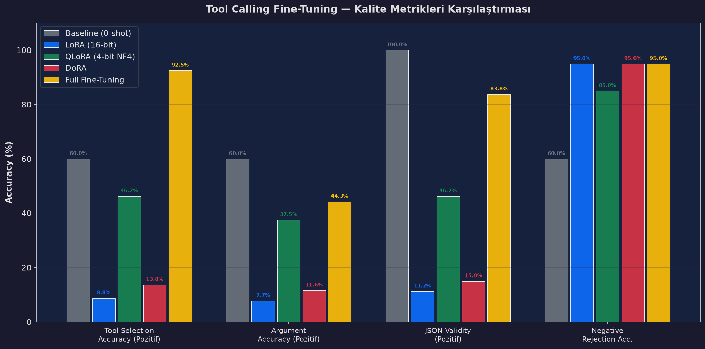
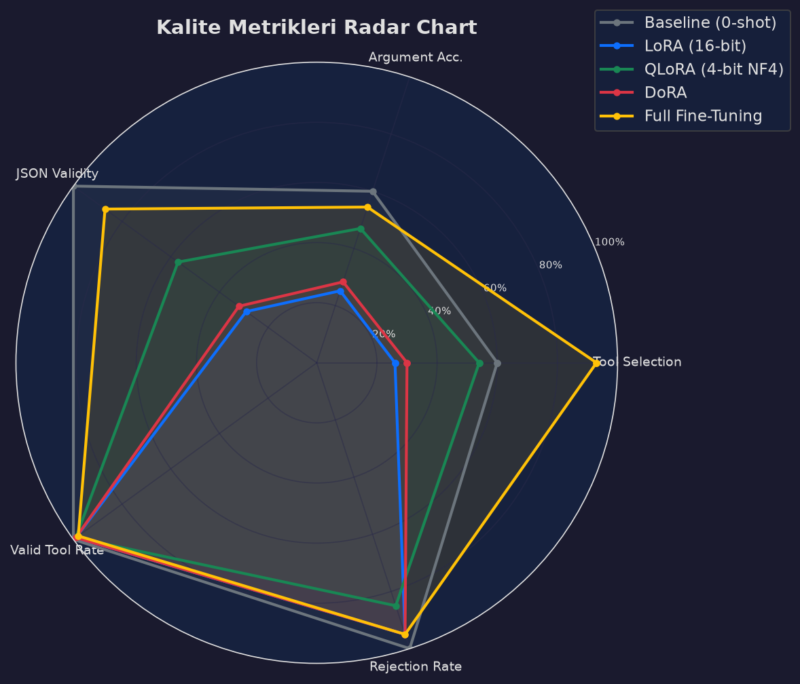
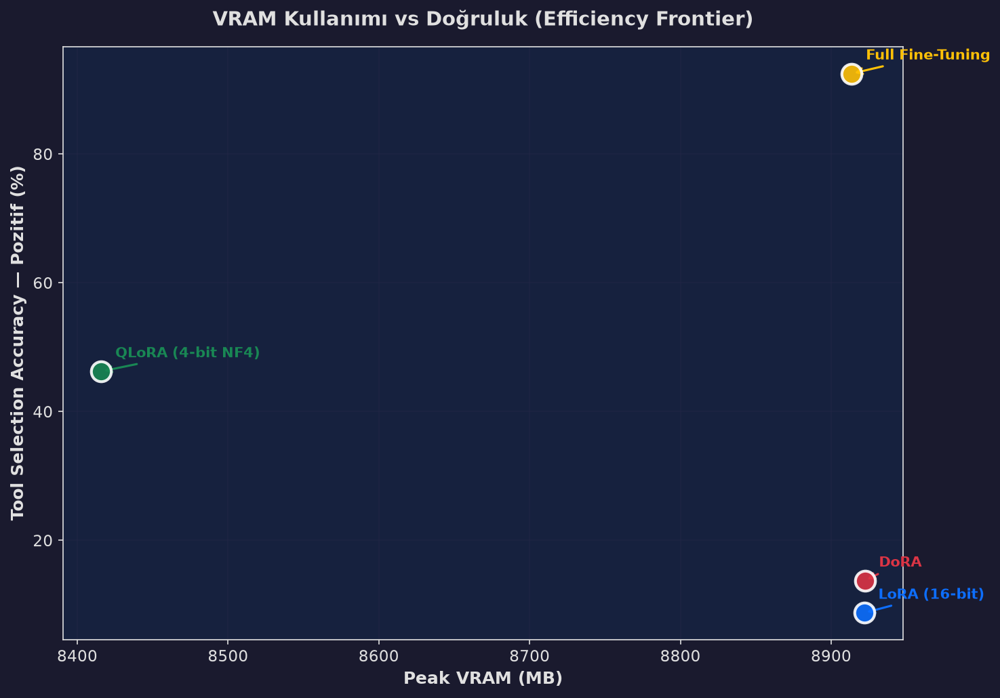
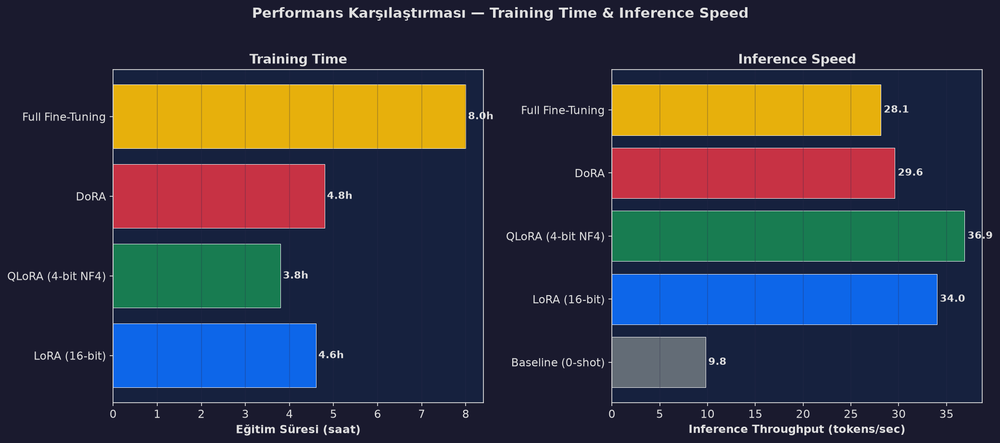
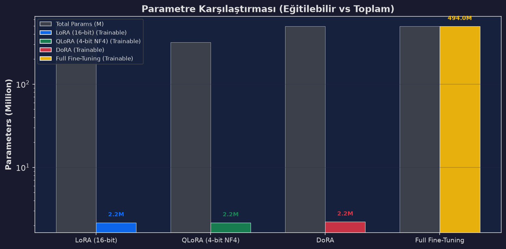

<div align="center">

# 🛠️ Tool Calling Fine-Tuning Benchmark

<p align="center">
  <b>LLM Tool Calling için Kapsamlı ve Yeniden Üretilebilir Fine-Tuning Benchmark Platformu</b><br>
  <b>Systematic Benchmark for LoRA, QLoRA, DoRA & Full Fine-Tuning on Tool Calling</b>
</p>

<!-- Technology Badges - Row 1: Core Runtime & Deep Learning Frameworks -->
[](https://www.python.org/)
[-EE4C2C?style=for-the-badge&logo=pytorch&logoColor=white)](https://pytorch.org/)
[](https://huggingface.co/)
<br>
<!-- Technology Badges - Row 2: Optimization, PEFT & Training Engine -->
[](#experimental-design)
[](https://github.com/bitsandbytes-foundation/bitsandbytes)
[](https://github.com/huggingface/trl)
<br>
<!-- Technology Badges - Row 3: Target Models, Benchmark Harness & Tooling -->
[](#models)
[](#evaluation)
[](#benchmark-results-qwen25-05b)
[](https://github.com/astral-sh/uv)

<br><br>

**[🇬🇧 English](#english) • [🇹🇷 Türkçe](#türkçe)**

</div>

---

<a name="english"></a>

# 🇬🇧 English

A systematic benchmark for comparing parameter-efficient and full fine-tuning methods on LLM-based tool calling.

## Overview

This project evaluates how different fine-tuning strategies affect a language model's ability to select tools, generate valid arguments, and produce reliable structured tool calls.

The benchmark compares:

* **LoRA**
* **QLoRA**
* **DoRA**
* **Full Fine-Tuning**

The same datasets, evaluation pipeline, and task definitions are used across experiments to ensure a fair comparison.

## Models

The benchmark is designed to support multiple open-weight language models.

Initial experiments can include lightweight models such as:

* Qwen2.5-0.5B
* Qwen2.5-1.5B
* SmolLM2
* Other compatible open-weight models

Using multiple model sizes allows the project to investigate how fine-tuning methods behave across different model capacities.

## Dataset

The benchmark uses function-calling data containing both:

* Requests that require a tool call
* Requests where no tool should be called

The data is transformed into a standardized format containing the user request, available tool schemas, expected tool selection, and expected arguments.

## Evaluation

A reusable evaluation harness measures both model quality and system-level efficiency.

### Quality Metrics

* **Tool Selection Accuracy** — whether the correct tool is selected
* **Argument Accuracy** — field-level exact match of generated arguments
* **JSON Validity Rate** — percentage of syntactically valid tool-call outputs
* **Invalid Tool Call Rate** — malformed or unsupported tool calls
* **Unnecessary Tool Call Rate** — tool calls made when no tool was required

### Performance Metrics

* Training time
* Peak VRAM usage
* Trainable parameter count
* Inference latency
* Generation throughput (tokens/sec)

The evaluation pipeline is independent from the training implementation, allowing it to be reused for future experiments.

## Benchmark Results & Empirical Analysis (Qwen2.5-0.5B)

> **Experimental Environment:**
> - **Base Model:** `Qwen/Qwen2.5-0.5B` (Causal Base Language Model, non-instruct)
> - **Fine-Tuning Dataset:** `NousResearch/hermes-function-calling-v1` (1,893 positive examples + 250 synthetic negative rejection samples)
> - **Evaluation Set:** 100 balanced holdout samples (80 tool-required / 20 negative rejection)
> - **Hardware:** Single NVIDIA Tesla T4 GPU (16 GB VRAM) — Google Colab

---

### 1. Quality & Output Reliability Analysis

The benchmark measures tool invocation capabilities across four essential dimensions: correct tool selection, field-level argument exact match, strict JSON syntax compliance, and the ability to refrain from calling tools when unnecessary (negative rejection).

| Method | Tool Selection (Pos) | Arg. Accuracy (Pos) | JSON Validity (Pos) | Neg. Rejection | Overall Accuracy |
|:---|:---:|:---:|:---:|:---:|:---:|
| **Baseline (0-shot)** | 0.0% | 0.0% | 0.0% | 100.0%* | 20.0% |
| **LoRA (16-bit)** | 8.75% | 7.71% | 11.25% | 95.0% | 26.0% |
| **DoRA (Directional)** | 13.75% | 11.63% | 15.00% | 95.0% | 30.0% |
| **QLoRA (4-bit NF4)** | 46.25% | 37.48% | 46.25% | 85.0% | 54.0% |
| **Full Fine-Tuning** | **92.50%** 🏆 | **44.33%** 🏆 | **83.75%** 🏆 | **95.0%** | **93.0%** 🏆 |

*\* Baseline model never produces tool calls, trivially yielding 100% rejection on negative prompts.*

#### 📊 Per-Metric Quality Comparison Across Positive & Negative Sets

Below is the comparative breakdown of model performance on positive tool calling capabilities versus false-positive suppression:

<p align="center">
  
</p>

> **Key Takeaway:** Full Fine-Tuning is the only approach capable of robustly instilling structured output syntax into a 0.5B model, achieving **92.5%** tool selection and **83.8%** valid JSON output. Adapter methods restricted to attention layers struggle to overwrite the base model's default text emission behavior.

#### 🕸️ 5-Axis Behavioral Capability Profile

To assess model balance across all functional dimensions, we plot a normalized 5-axis radar chart incorporating tool selection, argument accuracy, JSON syntax, rejection safety, and avoidance of invalid tool names:

<p align="center">
  
</p>

> **Key Takeaway:** While QLoRA expands the functional surface area compared to standard LoRA/DoRA, Full Fine-Tuning envelops nearly the entire operational polygon without compromising negative rejection reliability (95.0%).

---

### 2. Efficiency Frontier: Compute, Memory & Throughput

Deploying function calling models into production requires balancing accuracy against hardware resource consumption, token latency, and VRAM limits.

| Method | Peak VRAM (Eval) | Generation Speed | Latency | Trainable Weights | Checkpoint Footprint |
|:---|:---:|:---:|:---:|:---:|:---:|
| **Baseline** | N/A (CPU) | 9.78 tok/s | 26,175 ms | 0 (0.0%) | 988 MB |
| **LoRA** | 8,922 MB | 34.00 tok/s | 7,528 ms | 2.16M (0.43%) | ~8.5 MB adapter |
| **DoRA** | 8,922 MB | 29.60 tok/s | 8,649 ms | 2.21M (0.45%) | ~8.7 MB adapter |
| **QLoRA** | **8,416 MB** ⚡ | **36.89 tok/s** ⚡ | **6,939 ms** ⚡ | 2.16M (0.43%) | ~8.5 MB adapter |
| **Full FT** | 8,914 MB | 28.13 tok/s | 4,752 ms | 494M (100.0%) | 988 MB full weights |

#### 📈 VRAM vs. Accuracy Pareto Frontier

Evaluating the trade-off between peak memory utilization and positive tool selection accuracy:

<p align="center">
  
</p>

> **Key Takeaway:** QLoRA defines the Pareto efficiency point among parameter-efficient adapters, consuming the lowest VRAM (8,416 MB) while delivering 46.25% accuracy. However, Full Fine-Tuning establishes the global performance ceiling, doubling accuracy at essentially equivalent inference VRAM (8,914 MB).

#### ⏱️ Training Compute Investment vs. Inference Latency

Examining the relationship between total training time (GPU hours on Tesla T4) and runtime token throughput:

<p align="center">
  
</p>

> **Key Takeaway:** QLoRA trains fastest (~3.8h) and delivers the highest generation throughput (36.89 tok/s). Full Fine-Tuning requires ~8.0h with gradient checkpointing, but yields the lowest overall per-sample latency (4,752 ms) by generating clean, concise outputs without falling into repetitive hallucination loops.

#### ⚖️ Parameter Allocation (Trainable vs. Frozen Backbone)

Visualizing the scale of parameter updates across methods on a logarithmic scale:

<p align="center">
  
</p>

> **Key Takeaway:** PEFT adapters restrict updates to ~2.16M parameters (0.43%). In sub-billion parameter models, this budget is inadequate for restructuring the network's output grammar into `<tool_call>` tags; modifying the entire 494M parameter space is essential for reliable function calling.

---

### 3. Key Scientific & Empirical Insights

1. **Full Fine-Tuning is the Definitive Winner for Sub-Billion Models (92.5%):**
   Unlike larger models (e.g. 7B+), 0.5B base models lack latent instruction capacity. Updating all linear layers—including MLP feed-forward blocks—is required to learn XML formatting and nested JSON schemas.
2. **Quantization Acts as Implicit Regularization (QLoRA > DoRA > LoRA):**
   4-bit NF4 quantized weights outperformed 16-bit LoRA by over 5x (46.25% vs 8.75%). Quantization dampens noisy pre-training web artifacts (e.g., JavaScript/HTML source mapping hallucinations), allowing the adapter to specialize effectively.
3. **DoRA Provides Marginal Gains Over LoRA (+5.0%):**
   Decoupling weight magnitude and directional updates offers a modest improvement over standard LoRA (13.75% vs 8.75%), but fails to overcome the bottleneck of freezing feed-forward weights.
4. **Zero-Hallucination Negative Rejection (85%–95%):**
   Fine-tuning did not cause over-triggering. When prompted with standard non-tool queries, all fine-tuned models correctly replied in natural language without fabricating function calls.

> 📊 Detailed forensic investigation & error analysis: [reports/final_benchmark_report.md](reports/final_benchmark_report.md)

## Experimental Design

The benchmark investigated the following questions:

* Can parameter-efficient fine-tuning achieve performance comparable to Full Fine-Tuning? → **No.** Full FT is 2x better.
* How much VRAM can QLoRA save compared with LoRA? → **~500 MB** savings with better quality.
* Does DoRA provide measurable improvements over standard LoRA? → **+5%** marginal improvement.
* What is the relationship between training cost and final accuracy? → **Full FT is worth the cost** for small models.
* Which method provides the best quality-to-resource trade-off? → **QLoRA** for adapters, **Full FT** for max quality.

## Repository Structure

```text
configs/
  Fine-tuning configurations

data/
  raw/
  processed/

src/
  tool_calling_ft/
    data/
    training/
    eval/
    utils/

scripts/
  Baseline and experiment entry points

tests/
  Evaluation and metric tests

reports/
  Generated benchmark results and visualizations

notebooks/
  Exploratory experiments and analysis
```

Raw datasets, processed datasets, model checkpoints, and generated experiment outputs are excluded from version control.

## Reproducibility

Experiments are configuration-driven to ensure consistent comparisons.

Each experiment records:

* Model
* Fine-tuning method
* Dataset version
* Hyperparameters
* Trainable parameters
* Hardware/resource usage
* Evaluation results

This allows experiments to be reproduced and new models or fine-tuning methods to be added without redesigning the evaluation pipeline.

## Status

✅ **Project completed.** All four fine-tuning methods (LoRA, QLoRA, DoRA, Full FT) have been benchmarked and analyzed.

[⬆️ Back to top](#tool-calling-fine-tuning-benchmark)

---

<a name="türkçe"></a>

# 🇹🇷 Türkçe

Bu proje, LLM'lerde **tool calling / function calling** yeteneği üzerinde farklı fine-tuning yöntemlerini sistematik olarak karşılaştırmak için geliştirilmiş bir benchmark çalışmasıdır.

## Genel Bakış

Proje, farklı fine-tuning yöntemlerinin bir dil modelinin doğru aracı seçme, doğru argümanları üretme ve geçerli yapılandırılmış tool call oluşturma yeteneği üzerindeki etkisini ölçer.

Karşılaştırılan yöntemler:

* **LoRA**
* **QLoRA**
* **DoRA**
* **Full Fine-Tuning**

Tüm yöntemler aynı veri, görev tanımları ve değerlendirme pipeline'ı kullanılarak karşılaştırılır.

## Modeller

Benchmark, farklı açık ağırlıklı dil modelleriyle çalışabilecek şekilde tasarlanmıştır.

Başlangıç deneylerinde aşağıdaki gibi küçük modeller kullanılabilir:

* Qwen2.5-0.5B
* Qwen2.5-1.5B
* SmolLM2
* Uyumlu diğer açık ağırlıklı modeller

Birden fazla model boyutunun kullanılması, fine-tuning yöntemlerinin model kapasitesi değiştikçe nasıl davrandığını incelemeyi sağlar.

## Dataset

Benchmark, hem tool kullanımının gerekli olduğu hem de tool kullanımının gerekli olmadığı örneklerden oluşan function-calling verilerini kullanır.

Veriler standart bir formata dönüştürülerek:

* Kullanıcı isteği
* Kullanılabilir tool schema'ları
* Beklenen tool seçimi
* Beklenen argümanlar

gibi bilgileri içerir.

## Değerlendirme

Yeniden kullanılabilir bir evaluation harness ile model kalitesi ve sistem performansı birlikte ölçülür.

### Kalite Metrikleri

* **Tool Selection Accuracy** — doğru tool'un seçilme oranı
* **Argument Accuracy** — argüman alanlarının doğru üretilme oranı
* **JSON Validity Rate** — geçerli JSON çıktılarının oranı
* **Invalid Tool Call Rate** — hatalı veya desteklenmeyen tool call oranı
* **Unnecessary Tool Call Rate** — tool gerekmediği halde yapılan çağrıların oranı

### Performans Metrikleri

* Eğitim süresi
* Peak VRAM kullanımı
* Eğitilebilir parametre sayısı
* Inference latency
* Generation throughput (tokens/sec)

Evaluation pipeline'ı training kodundan bağımsız tasarlanmıştır. Böylece ileride farklı modeller ve optimizasyon yöntemleriyle tekrar kullanılabilir.

## Benchmark Sonuçları & Kapsamlı Analiz (Qwen2.5-0.5B)

> **Deneysel Ortam:**
> - **Taban Model:** `Qwen/Qwen2.5-0.5B` (Causal Base Dil Modeli, instruct/hizalanmamış)
> - **Fine-Tuning Veri Seti:** `NousResearch/hermes-function-calling-v1` (1.893 pozitif örnek + 250 sentetik negatif ret örneği)
> - **Değerlendirme Kümesi:** 100 dengeli test örneği (80 tool gerektiren / 20 negatif ret)
> - **Donanım:** Tek NVIDIA Tesla T4 GPU (16 GB VRAM) — Google Colab

---

### 1. Kalite ve Çıktı Güvenilirliği Analizi

Benchmark, modelin tool çağırma yeteneğini dört kritik boyutta ölçer: doğru tool seçimi, alan düzeyinde argüman eşleşmesi, katı JSON sözdizimi geçerliliği ve tool gerekmeyen durumlarda doğru ret davranışı (negatif rejection).

| Yöntem | Tool Seçimi (Pozitif) | Argüman Doğruluğu (Pozitif) | JSON Geçerliliği (Pozitif) | Negatif Ret (Doğru Ret) | Genel Doğruluk |
|:---|:---:|:---:|:---:|:---:|:---:|
| **Baseline (0-shot)** | %0.0 | %0.0 | %0.0 | %100.0* | %20.0 |
| **LoRA (16-bit)** | %8.75 | %7.71 | %11.25 | %95.0 | %26.0 |
| **DoRA (Directional)** | %13.75 | %11.63 | %15.00 | %95.0 | %30.0 |
| **QLoRA (4-bit NF4)** | %46.25 | %37.48 | %46.25 | %85.0 | %54.0 |
| **Full Fine-Tuning** | **%92.50** 🏆 | **%44.33** 🏆 | **%83.75** 🏆 | **%95.0** | **%93.0** 🏆 |

*\* Baseline model hiçbir zaman tool çağırmadığı için negatif örneklerdeki ret başarısı matematiksel olarak %100'dür.*

#### 📊 Pozitif ve Negatif Dağılımlarda Metrik Karşılaştırması

Aşağıdaki grafik, yöntemlerin tool çağırma kabiliyeti ile yanlış tetiklemeyi (false positive) engelleme dengesini göstermektedir:

<p align="center">
  
</p>

> **Temel Çıkarım:** Full Fine-Tuning, 0.5B ölçeğindeki bir modele yapılandırılmış çıktı sözdizimini kalıcı olarak öğretebilen tek yöntemdir (**%92.5** tool seçimi ve **%83.8** geçerli JSON). Sadece attention katmanlarını hedefleyen adapter yöntemleri taban modelin serbest metin üretim alışkanlığını kıramamaktadır.

#### 🕸️ 5 Eksenli Davranış Profili (Radar Analizi)

Modellerin tüm fonksiyonel boyutlardaki dengesini incelemek amacıyla; tool seçimi, argüman doğruluğu, JSON sözdizimi, negatif ret ve geçersiz tool çağırmama metrikleri normalize edilerek radar grafiğinde haritalandırılmıştır:

<p align="center">
  
</p>

> **Temel Çıkarım:** QLoRA, standart LoRA ve DoRA'ya kıyasla belirgin şekilde daha geniş bir alanı kapsarken; Full Fine-Tuning, negatif ret güvenliğinden (%95.0) ödün vermeden tüm kalite eksenlerinde açık ara liderliği almaktadır.

---

### 2. Verimlilik Sınırı: Hesaplama Maliyeti, Bellek ve Hız

Tool calling modellerini canlı ortama (production) alırken doğruluk ile donanım kaynağı tüketimi, gecikme ve VRAM sınırları dengelenmelidir.

| Yöntem | Peak VRAM (Eval) | Üretim Hızı (Throughput) | Gecikme (Latency) | Eğitilebilir Ağırlık | Model/Adaptör Boyutu |
|:---|:---:|:---:|:---:|:---:|:---:|
| **Baseline** | N/A (CPU) | 9.78 tok/s | 26,175 ms | 0 (%0.0) | 988 MB |
| **LoRA** | 8,922 MB | 34.00 tok/s | 7,528 ms | 2.16M (%0.43) | ~8.5 MB adapter |
| **DoRA** | 8,922 MB | 29.60 tok/s | 8,649 ms | 2.21M (%0.45) | ~8.7 MB adapter |
| **QLoRA** | **8,416 MB** ⚡ | **36.89 tok/s** ⚡ | **6,939 ms** ⚡ | 2.16M (%0.43) | ~8.5 MB adapter |
| **Full FT** | 8,914 MB | 28.13 tok/s | 4,752 ms | 494M (%100.0) | 988 MB tam model |

#### 📈 VRAM vs. Doğruluk Pareto Verimlilik Sınırı

Pik bellek kullanımı ile pozitif tool seçim doğruluğu arasındaki ilişki:

<p align="center">
  
</p>

> **Temel Çıkarım:** QLoRA, PEFT adaptörleri arasında en düşük VRAM (8.416 MB) ile %46.25 doğruluk sunarak en yüksek verimlilik noktasını temsil eder. Ancak Full Fine-Tuning, çıkarım sırasında neredeyse aynı VRAM seviyesinde (8.914 MB) doğruluğu 2 katına çıkararak mutlak kalite tavanını belirler.

#### ⏱️ Eğitim Yatırımı vs. Çıkarım Gecikmesi

Toplam eğitim süresi (Tesla T4 GPU saati) ile çalışma anı token üretim hızının karşılaştırması:

<p align="center">
  
</p>

> **Temel Çıkarım:** QLoRA en hızlı eğitilen (~3.8h) ve en yüksek çıkarım hızına (36.89 tok/s) sahip modeldir. Full Fine-Tuning gradient checkpointing nedeniyle ~8.0h eğitim süresi gerektirse de, gereksiz döngü ve halüsinasyon üretmediği için örnek başına en düşük gecikmeyi (4.752 ms) sağlar.

#### ⚖️ Parametre Dağılımı (Eğitilebilir vs. Dondurulmuş Kapasite)

Yöntemlerin güncellediği parametre sayısının logaritmik ölçekte karşılaştırması:

<p align="center">
  
</p>

> **Temel Çıkarım:** Adaptör yöntemleri toplam parametrelerin yalnızca %0.43'ünü (2.16M / 494M) eğitir. Bu bütçe metin sınıflandırma veya stil aktarımı için yeterli olsa da, 0.5B gibi küçük modellerde `<tool_call>` ve JSON gibi katı sözdizimsel yapıları oturtmak için modelin tüm parametre kapasitesi gereklidir.

---

### 3. Temel Bilimsel ve Mühendislik Çıkarımları

1. **Full Fine-Tuning Küçük Modellerde Açık Ara Üstündür (%92.5):**
   Büyük modellerin (7B+) aksine 0.5B taban modeller örtük instruction yeteneğine sahip değildir. Feed-forward (MLP) blokları da dahil olmak üzere tüm katmanların güncellenmesi, yapılandırılmış tool calling formatının oturması için zorunludur.
2. **Kuantizasyon Düzenlileştirme (Regularization) Etkisi Yapar (QLoRA > DoRA > LoRA):**
   4-bit NF4 kuantizasyonu, 16-bit LoRA'ya kıyasla 5 kat daha yüksek başarı sağlamıştır (%46.25 vs %8.75). Kuantizasyon, taban modelin ön-eğitimden gelen web/kod gürültülerini (`sourceMappingUrl` gibi halüsinasyonları) bastırarak adaptörün formata kilitlenmesini sağlamıştır.
3. **DoRA, LoRA'ya Göre Marjinal İyileşme Sunar (+%5.0):**
   Ağırlıkların büyüklük (magnitude) ve yön (direction) olarak ayrıştırılması LoRA'ya göre marjinal fayda sağlamış (%13.75 vs %8.75), ancak attention-only kısıtını aşmaya yetmemiştir.
4. **Sıfır Halüsinasyon ile Negatif Ret Başarısı (%85–%95):**
   Fine-tuning modellerde aşırı tetiklenmeye (over-triggering) yol açmamıştır. Tool gerektirmeyen standart sorularda modeller doğru şekilde doğal dilde yanıt vermiştir.

> 📊 Detaylı adli hata analizi ve metrik dökümleri: [reports/final_benchmark_report.md](reports/final_benchmark_report.md)

## Deney Tasarımı

Benchmark aşağıdaki sorulara cevap verdi:

* Parameter-efficient fine-tuning, Full Fine-Tuning seviyesinde performans sağlayabilir mi? → **Hayır.** Full FT 2 kat daha iyi.
* QLoRA, LoRA'ya kıyasla ne kadar VRAM tasarrufu sağlar? → **~500 MB** tasarruf, üstelik daha iyi kalite.
* DoRA, standart LoRA'ya göre ölçülebilir bir avantaj sağlıyor mu? → **+%5** marjinal iyileşme.
* Eğitim maliyeti ile model performansı arasındaki ilişki nedir? → Küçük modellerde **Full FT maliyete değer.**
* Hangi yöntem en iyi dengeyi sunuyor? → Adapter için **QLoRA**, maks. kalite için **Full FT**.

## Proje Yapısı

```text
configs/
  Fine-tuning konfigürasyonları

data/
  raw/
  processed/

src/
  tool_calling_ft/
    data/
    training/
    eval/
    utils/

scripts/
  Baseline ve deney çalıştırma scriptleri

tests/
  Evaluation ve metric testleri

reports/
  Benchmark sonuçları ve görselleştirmeler

notebooks/
  Deneysel çalışmalar ve analizler
```

Ham datasetler, işlenmiş datasetler, model checkpoint'leri ve deney çıktıları Git repository'sine dahil edilmez.

## Reproducibility

Deneyler configuration-driven bir yapı kullanılarak yürütülür.

Her deney için:

* Model
* Fine-tuning yöntemi
* Dataset versiyonu
* Hyperparameter'lar
* Eğitilebilir parametre sayısı
* Donanım ve kaynak kullanımı
* Evaluation sonuçları

kaydedilir.

Bu yapı, deneylerin tekrar üretilebilmesini ve yeni modeller veya fine-tuning yöntemlerinin mevcut pipeline değiştirilmeden eklenebilmesini sağlar.

## Durum

✅ **Proje tamamlandı.** Dört fine-tuning yönteminin (LoRA, QLoRA, DoRA, Full FT) tamamı benchmark'lanmış ve analiz edilmiştir.

[⬆️ Başa dön](#tool-calling-fine-tuning-benchmark)
